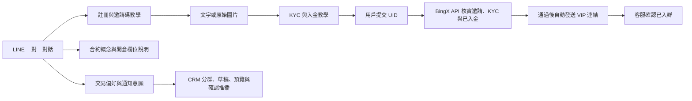

# MetaBear 第一版產品範圍

確認日期：2026-09-14（台北）。

## 已確認

- 交易所先支援 BingX，邀請碼 `ZD0CQ0`，邀請連結 `https://bingx.com/invite/ZD0CQ0`。
- 社群要求已入金，不設最低金額，允許內部轉帳；仍須符合推薦歸屬與 KYC。依使用者最新決策，不要求 LINE 帳號持有證明。
- 目前仍在測試，無須遷移既有客戶資料；保留 Python 舊程式作參考。
- 已實作 BingX 代理 API 同步與自動審核；啟用及限制見 [自動化上線](AUTOMATION.md)。

## 用戶流程

教學進度只代表目前瀏覽／詢問的步驟；KYC、推薦歸屬、入金與入群不能由瀏覽行為推定。查看前面的教學不會把已入群或待核實客戶降級。

## CRM 的資料含義

| 資料         | 來源與用途                                                        |
| ------------ | ----------------------------------------------------------------- |
| LINE userId  | 經 LINE 簽章驗證的一對一 webhook；用於配對用戶                    |
| 個人 LINE ID | 人工選填；不是 webhook userId，不能代替它發送訊息                 |
| 客服稱呼     | 管理員手動填寫，第一版不主動取得 LINE 個人資料                    |
| BingX UID    | 用戶或管理員提交；同一 UID 不允許綁定多位 LINE 用戶               |
| 推薦狀態     | 待核實／已核實／需補正，已核實需有人工核對依據                    |
| 入金狀態     | 獨立核實已入金，允許內部轉帳，與推薦狀態分開                            |
| 已入群       | 邀請發送與已入群分開；客服依社群名單核對，保存依據與操作人         |
| 月交易量     | 指定月份的成交總額、USDT 等值、來源與備註；同月更新為覆蓋而非相加 |
| 偏好         | 現貨／合約／兩者／先學基礎／未設定                                |
| 訂閱         | 預設未訂閱，只能由用戶在 LINE 主動設定，封鎖時撤銷                |

尚未填寫的交易量保留空值，不等同零。使用交易量上下限篩選時，未知數量不會符合條件。草稿保存篩選條件與當下受眾人數；預覽時固定實際名單與訊息，確認後才送出。逐人送出前會再核對訂閱、封鎖與原篩選條件。

## 教學與人工服務

用戶直接在 LINE 自然提問，不必輸入指定關鍵字。OpenAI 依問題、最近教學主題與文字／圖片偏好，選出已確認教材；程式把文字和 LINE 原生圖片訊息送回同一個對話。註冊、邀請碼、KYC、UID、入群規則和合約概念使用已確認內容，模型不能自行改寫商務條件或指定新的圖片網址。

新版使用 OpenAI Responses API，傳送當則問題、教材、最近教學主題與格式偏好，設定 `store: false`。不附帶 CRM 姓名、UID、交易量或備註，不保存完整聊天歷史。D1 的 `teaching_context` 分別保存每位用戶最近的主題與格式；回選單會清除教學上下文。模型只輸出教材 ID 與格式，這版不是任意主題的自由生成聊天助手。API 失敗或輸出不合法時使用常見問題的備援規則。

人工協助會建立後台待辦標記；客服回覆與用戶提交的圖片／影片仍在 LINE 官方帳號處理。本版不把入金證明複製到公開網站，也不自動辨識資產或證件。漏填邀請碼、舊帳號推薦歸屬、身分轉移等例外交由人工確認交易所當前規則；「剛完成註冊」則繼續 KYC 教學。

## 後續擴充

1. 持續更新既有入金截圖，補充 UID 操作畫面與 iOS／Android 版本。
2. 推播擴充：圖片訊息、可取消的未發送排程，以及更細的逐人結果檢視；目前已支援文字推播、配額預檢、確認、重試鍵與退訂排除。
3. 交易量 CSV 匯入：先提供真實代理報表樣本，確認交易量單位、月份與欄位；之後才串 API。
4. 分析師報單工作台（`/desk`）已可直送已入群且訂閱該品項的用戶；`ADMIN_EMAIL` 同時是管理員與第一位分析師，沿用既有 LINE 綁定收 OTP 與發送報單。管理員另外負責帳號、急停與稽核，不做逐單審核。圖檔以不可猜測的 `/media/signals/:id` 提供，尚未改為 R2。
5. 若要在 CRM 內查看證明，再加入私有 R2、授權下載與保留期限。

## 來源

- [原註冊／入群流程](https://app.notion.com/p/26fe08720786805185bde4952de1d9d7)：BingX、邀請碼、客服 LINE、200 USDT 與人工核實流程。註冊和 KYC 原圖已取得並轉為 JPEG；未用 AI 重繪交易所畫面。
- [原 BitoPro 入金教學](https://app.notion.com/p/BitoPro-311e0872078680f59fbbec1cecb2e648)：原文步驟順序有 1、2、4、3，不直接照搬。
- [原信用卡入金教學](https://app.notion.com/p/BingX-USDT-26fe0872078680c39518eb3509bd0246)：100 USDT 促銷與主頁衝突，原採 200 USDT，最新規則已取消最低金額；舊銀行推薦與到帳時間未當成現行規則。
- [LINE 使用者識別碼](https://developers.line.biz/en/docs/messaging-api/getting-user-ids/)：userId 與個人 LINE ID 不同。
- [LINE webhook 驗證](https://developers.line.biz/en/docs/messaging-api/verify-webhook-signature/)與[接收事件](https://developers.line.biz/en/docs/messaging-api/receiving-messages/)：簽章驗證、重送與事件識別。
- [BingX 保證金名詞](https://bingx.com/en/support/articles/360045900114-margin-terms-of-perpetual-swap)與[逐倉／全倉說明](https://login.bingx.com/en/support/articles/36368664788377)：基礎教學參考；具體數值以當前合約規則為準。
